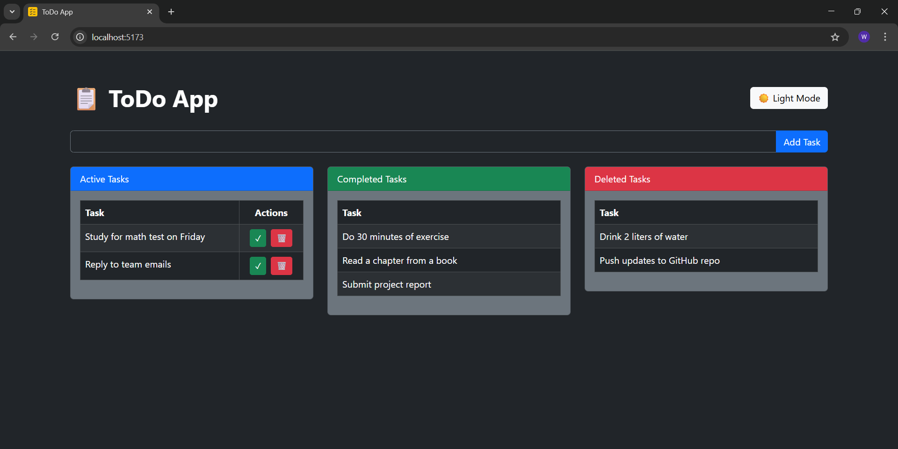
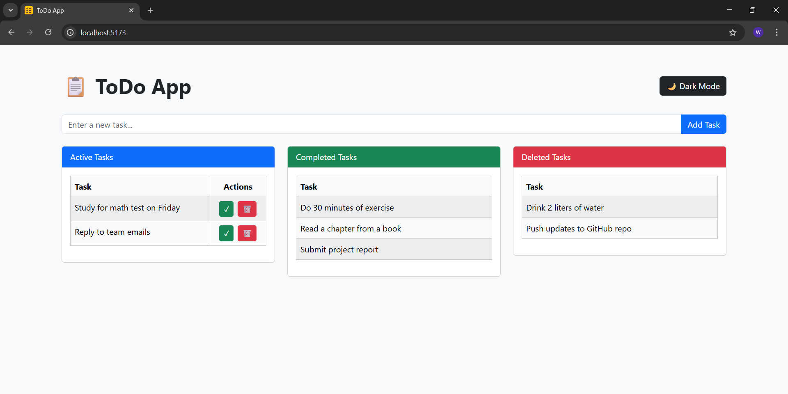

# 📝 ToDo App — React + Vite

A responsive and theme-switchable ToDo App built with **React** and **Vite**, styled using **Bootstrap 5**.  
It allows users to add, complete, delete, and organize tasks efficiently in **dark or light mode**.

---

## 📸 Screenshot




---

## 🚀 Features

- ✅ Add and track tasks easily
- 🌙 Toggle between Light and Dark mode
- ✅ Separate views for Active, Completed, and Deleted tasks
- ⚡ Powered by Vite for blazing-fast dev experience
- 🎨 Styled with Bootstrap 5

---

## 🛠️ Tech Stack

- **React**
- **Vite**
- **React Bootstrap**
- **ESLint** (basic rules)
- **JavaScript (ES6+)**

---

## 🧪 How to Run the App Locally

### 1. Clone the Repository

```bash
git clone https://github.com/rahulmd03/todo-react-app.git
cd todo-react-app
```

### 2. Install Dependencies

```bash
npm install
```
### 3. Start the Development Server

```bash
npm run dev
```
Then open your browser and go to:

```bash
http://localhost:5173
```


